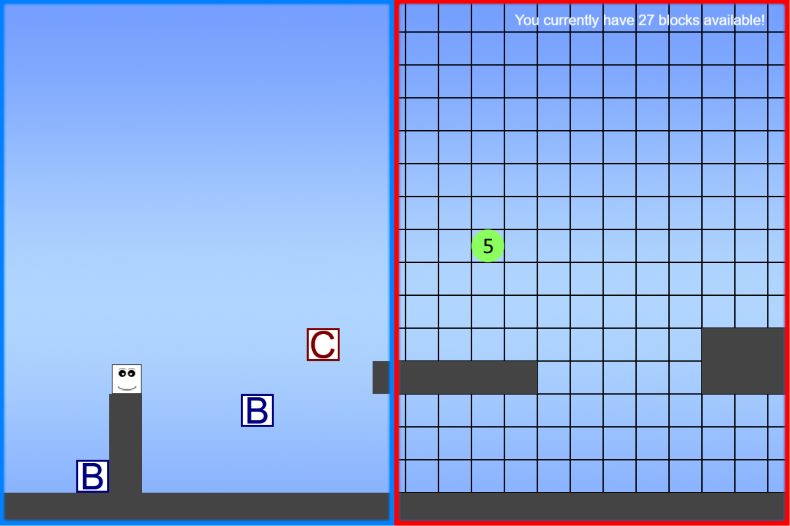

# Gamedev Game - Time to Play

Time to Play is a prototype for a game that we created during a gamejam in 2014 (!). If I recall correctly, the gamedev had a theme around the younger audience. 

This is a two-player collaborative, auto-scrolling platformer. The "player" is meant to reach the end of the level before he touches the border of the screen. The "helper" uses their mouse to place blocks with which the other player can interact to move around obstacles. The player and helper are locked to the left and right sides of the screen, respectively. Collect Block Boosters to allow the helper to place more blocks!

## [Play it!](https://athosvk.com/time-to-play/)

## Controls
R - Reload 

### "Player" character
- ⬅️/➡️ - Move left/right
- ⬆️ - Jump

### "Helper" character
- 🖱️L - Place block
  

